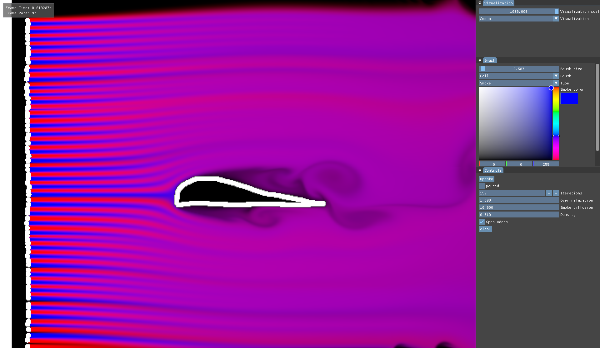
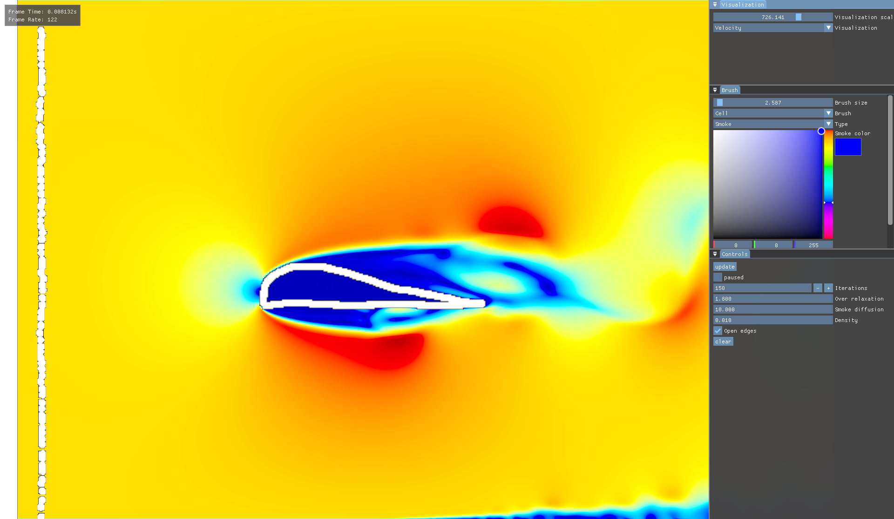
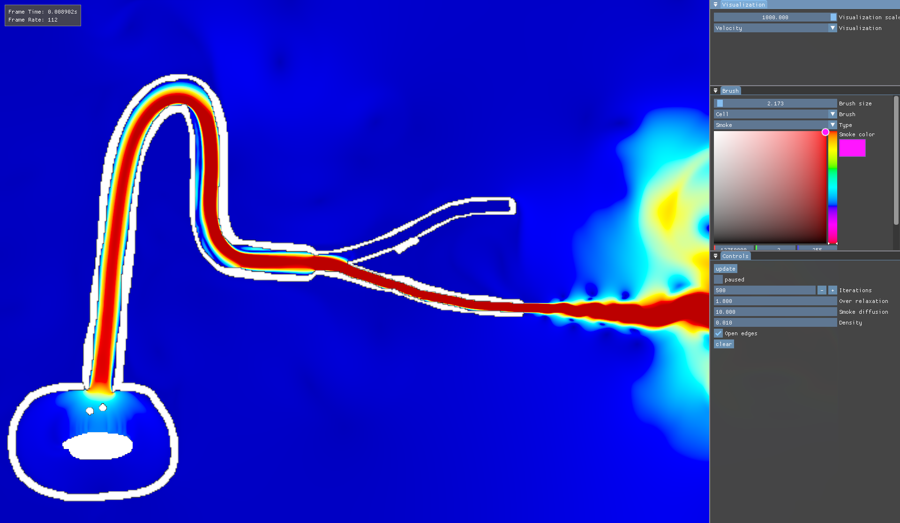
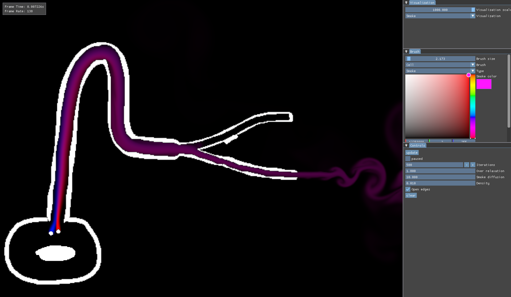

# EngineZ

A work-in-progress graphics engine built with Vulkan. Built for personal learning.

---

## Features

Currently, it only has a simple windowing API. ImGui is integrated into the windows, and UI can be built directly in the `render` method of `ezWindow`. I'm not yet sure which direction I'll take the engine, but it's enough for my current use.

---

## Examples

Since maintaining separate projects for testing the engine was impractical, some examples are included directly inside the engine repo.

### Fluid Sim

A simple grid-based fluid simulation, made to learn compute shaders. Based on these [course notes](https://www.cs.ubc.ca/~rbridson/fluidsimulation/fluids_notes.pdf) and Sebastian Lague's [video](https://youtu.be/Q78wvrQ9xsU?si=qZTFRF1NOh-2jKjj). The solver consists of four main steps:

- **Advection**: Semi-Lagrangian method is used. Custom sampling functions are used for now. may switch to Vulkan samplers in the future.
- **Diffusion**: Smoke is diffused.
- **Projection**: Red-Black Gauss-Seidel method is used. Constant terms are pre-processed and saved to a texture for fewer texture reads.
- **Velocity Update**: Velocities are updated based on the new pressure values, so the advection step operates on divergence-free textures.

Each of these steps is translated into a compute kernel written in HLSL. Kernels are compiled separately using a Python script. There are other kernels as well, such as the brush and visualization kernels. For visualization, there are smoke, speed, pressure, and divergence maps.

For scene building, there are a few cell types: velocity cells with constant velocity, pressure cells with constant pressure, and smoke cells with constant smoke color. Fun simulations can be built with these building blocks. for example, a wind tunnel:

<figure align="center">
  
  
  <figcaption align="center">Simple wind tunnel</figcaption>
</figure>

or some pipes to play with velocities:

<figure align="center">
  
  
  <figcaption align="center">Pipes</figcaption>
</figure>

---

## How To Build

Not intended for use by others, and not particularly useful in its current state, so I'll leave this section empty for now.